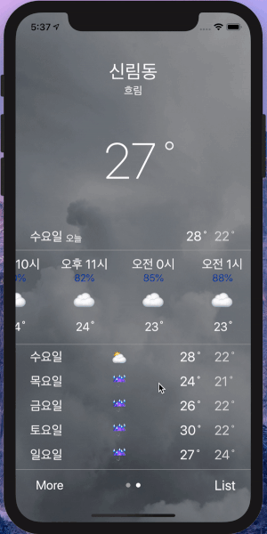

# Weather App

Open API를 이용한 날씨 앱입니다.

<div>
</div>

<br>

###  Feature
1. 현재 위치 기반의 날씨 정보
2. 도시 검색 기능 및 목록 추가
3. 추가한 도시의 날씨 정보

### 구현

| **구분** |   **역할**   |
| :------------- | :--------------- |
| **ViewController** |
|       MainViewController       |       날씨 데이터 업데이트 및 리스트 갯수 만큼 페이징 뷰 생성        |
|       MainContentViewController       |       페이징 뷰에 들어갈 컨텐츠 뷰이다. 해당 지역의 현재, 시간대별, 요일별로 날씨 정보를 표시하고, 관련 웹사이트로 이동할 수 있다.        |
|       ListViewController       |       지역 리스트 뷰이다. 뷰를 삭제할 수 있고, 섭씨/화씨 표기를 할 수 있다.        |
|       SearchViewController       |       검색 뷰이다. 지역을 검색할 수 있고, 리스트에 추가할 수 있다.        |
| **ETC**  |
|       ApiClient       |       네트워크 기본 프로토콜 및 공통 메서드 구현        |
|       WTEnum       |       각종 고정 데이터 Enum        |
|       WTUrl       |       url 정보        |
|       WTFormat       |       각종 Data Format Util        |


### 설계


### Git Management

- master : 최종본  
- develop : 코드리뷰 후 Merge 버전, Hotfix 버전, release 버전  
- feature : 마일스톤 단위로 관리

**Commit Message 양식은 아래의 규칙을 따른다.**  

```
1. feature : [마일스톤 ID] 메세지  
2. develop : [Merge 날짜] 메세지  
3. master : [배포 버전_날짜] 메세지  
```


| **마일스톤 ID** |   **주요 화면**   |
| :-------------: | :---------------: |
|       MMA       |       메인        |
|       MML       |       리스트        |
|       MMS       |       검색화면        |


### Style Guide

- Swift Dev Version : 5
- Deployment Target : 12.2
- Device Target : iPhone
- Code Architecture : MVC  


### + code refactoring & Study

인턴십 지원은 끝났지만 study 겸 code , refectoring 진행 예정

- master에 계속 업데이트

```
1. master : [적용기능] 세부 내용  
```

### + 목표

```
1. 라이브러리 사용하지 않고 MVC 패턴을 사용한 현 프로젝트 refactoring 및 버그 수정
2. 책 꼼꼼한 재은씨의 swift: 기본편을 보면서 적용할 수 있는 UI기능 적용해보기
3. 책 꼼꼼한 재은씨의 swift: 실전편을 보면서 적용할 수 있는 기능 적용해보기
4. 데이터 저장 형식 SQL로 변환
5. MVVM 패턴 적용해보기
6. RxSwift 사용해보기

```
